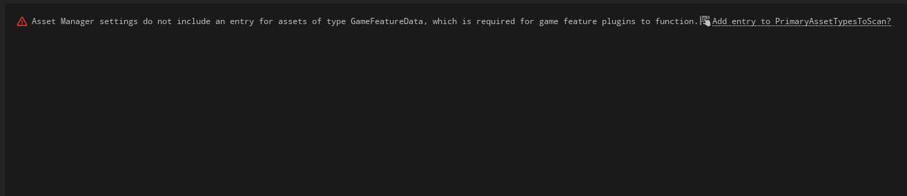
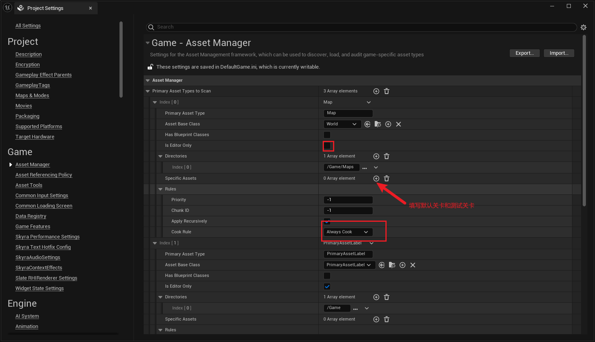
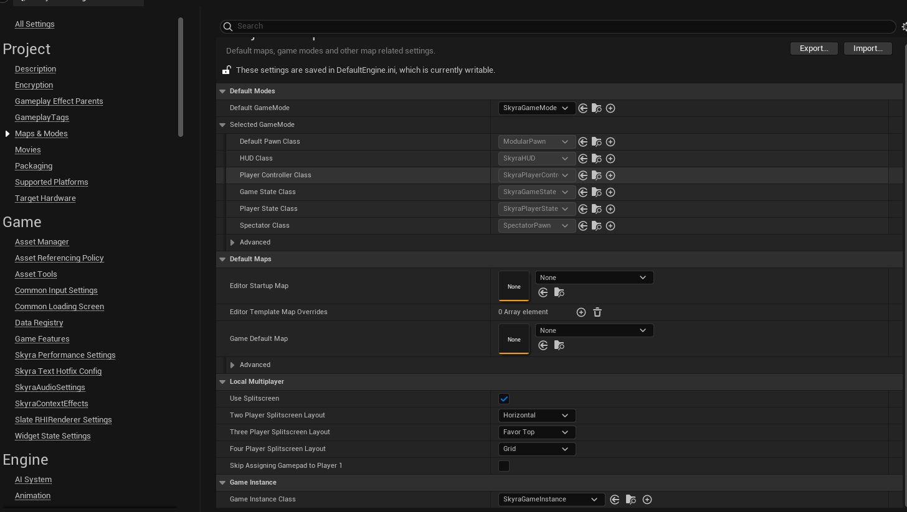

## 部署
最少需要填写以下内容






这里可以先不填，因为最好按照项目的不同配置蓝图类GameInstance和Gamemode


```ini
# defaultGame.ini
[/Script/SkyraGame.SkyraPlayerController]
InputYawScale=1.0
InputPitchScale=1.0
InputRollScale=1.0
ForceFeedbackScale=1.0

[/Script/GameplayAbilities.AbilitySystemGlobals]
AbilitySystemGlobalsClassName=/Script/SkyraGame.SkyraAbilitySystemGlobals
GlobalGameplayCueManagerClass=/Script/SkyraGame.SkyraGameplayCueManager
PredictTargetGameplayEffects=false
bUseDebugTargetFromHud=true
ActivateFailIsDeadName=Ability.ActivateFail.IsDead
ActivateFailCooldownName=Ability.ActivateFail.Cooldown
ActivateFailCostName=Ability.ActivateFail.Cost
ActivateFailTagsBlockedName=Ability.ActivateFail.TagsBlocked
ActivateFailTagsMissingName=Ability.ActivateFail.TagsMissing
ActivateFailNetworkingName=Ability.ActivateFail.Networking
+GameplayCueNotifyPaths=/Game/GameplayCueNotifies
+GameplayCueNotifyPaths=/Game/GameplayCues

[/Script/GameFeatures.GameFeaturesSubsystemSettings]
GameFeaturesManagerClassName=/Script/SkyraGame.SkyraGameFeaturePolicy

[/Script/SkyraGame.SkyraAssetManager]
SkyraGameDataPath=/Game/DefaultGameData.DefaultGameData
DefaultPawnData=/Game/Characters/Heroes/EmptyPawnData/DefaultPawnData_EmptyPawn.DefaultPawnData_EmptyPawn

[/Script/Engine.AssetManagerSettings]
-PrimaryAssetTypesToScan=(PrimaryAssetType="Map",AssetBaseClass=/Script/Engine.World,bHasBlueprintClasses=False,bIsEditorOnly=True,Directories=((Path="/Game/Maps")),SpecificAssets=,Rules=(Priority=-1,ChunkId=-1,bApplyRecursively=True,CookRule=Unknown))
-PrimaryAssetTypesToScan=(PrimaryAssetType="PrimaryAssetLabel",AssetBaseClass=/Script/Engine.PrimaryAssetLabel,bHasBlueprintClasses=False,bIsEditorOnly=True,Directories=((Path="/Game")),SpecificAssets=,Rules=(Priority=-1,ChunkId=-1,bApplyRecursively=True,CookRule=Unknown))
+PrimaryAssetTypesToScan=(PrimaryAssetType="Map",AssetBaseClass="/Script/Engine.World",bHasBlueprintClasses=False,bIsEditorOnly=False,Directories=((Path="/Game/Maps")),SpecificAssets=("/Game/System/FrontEnd/Maps/L_SkyraFrontEnd.L_SkyraFrontEnd","/Game/System/DefaultEditorMap/L_DefaultEditorOverview.L_DefaultEditorOverview"),Rules=(Priority=-1,ChunkId=-1,bApplyRecursively=True,CookRule=AlwaysCook))
+PrimaryAssetTypesToScan=(PrimaryAssetType="SkyraGameData",AssetBaseClass="/Script/SkyraGame.SkyraGameData",bHasBlueprintClasses=False,bIsEditorOnly=False,Directories=,SpecificAssets=("/Game/DefaultGameData.DefaultGameData"),Rules=(Priority=-1,ChunkId=-1,bApplyRecursively=True,CookRule=AlwaysCook))
+PrimaryAssetTypesToScan=(PrimaryAssetType="PrimaryAssetLabel",AssetBaseClass="/Script/Engine.PrimaryAssetLabel",bHasBlueprintClasses=False,bIsEditorOnly=True,Directories=((Path="/Game")),SpecificAssets=,Rules=(Priority=-1,ChunkId=-1,bApplyRecursively=True,CookRule=Unknown))
+PrimaryAssetTypesToScan=(PrimaryAssetType="GameFeatureData",AssetBaseClass="/Script/GameFeatures.GameFeatureData",bHasBlueprintClasses=False,bIsEditorOnly=False,Directories=((Path="/Game/Unused")),SpecificAssets=,Rules=(Priority=-1,ChunkId=-1,bApplyRecursively=True,CookRule=AlwaysCook))
+PrimaryAssetTypesToScan=(PrimaryAssetType="SkyraExperienceDefinition",AssetBaseClass="/Script/SkyraGame.SkyraExperienceDefinition",bHasBlueprintClasses=True,bIsEditorOnly=False,Directories=((Path="/Game/System/Experiences")),SpecificAssets=("/Game/System/FrontEnd/B_SkyraFrontEnd_Experience.B_SkyraFrontEnd_Experience"),Rules=(Priority=-1,ChunkId=-1,bApplyRecursively=True,CookRule=AlwaysCook))
+PrimaryAssetTypesToScan=(PrimaryAssetType="SkyraUserFacingExperienceDefinition",AssetBaseClass="/Script/SkyraGame.SkyraUserFacingExperienceDefinition",bHasBlueprintClasses=False,bIsEditorOnly=False,Directories=((Path="/Game/UI/Temp"),(Path="/Game/System/Playlists")),SpecificAssets=,Rules=(Priority=-1,ChunkId=-1,bApplyRecursively=True,CookRule=AlwaysCook))
+PrimaryAssetTypesToScan=(PrimaryAssetType="SkyraLobbyBackground",AssetBaseClass="/Script/SkyraGame.SkyraLobbyBackground",bHasBlueprintClasses=False,bIsEditorOnly=False,Directories=,SpecificAssets=,Rules=(Priority=-1,ChunkId=-1,bApplyRecursively=True,CookRule=AlwaysCook))
+PrimaryAssetTypesToScan=(PrimaryAssetType="SkyraExperienceActionSet",AssetBaseClass="/Script/SkyraGame.SkyraExperienceActionSet",bHasBlueprintClasses=False,bIsEditorOnly=False,Directories=,SpecificAssets=,Rules=(Priority=-1,ChunkId=-1,bApplyRecursively=True,CookRule=AlwaysCook))
bOnlyCookProductionAssets=False
bShouldManagerDetermineTypeAndName=False
bShouldGuessTypeAndNameInEditor=True
bShouldAcquireMissingChunksOnLoad=False
bShouldWarnAboutInvalidAssets=True
MetaDataTagsForAssetRegistry=()

[/Script/SkyraGame.SkyraUIManagerSubsystem]
DefaultUIPolicyClass=/Game/UI/B_SkyraUIPolicy.B_SkyraUIPolicy_C

[/Script/SkyraGame.SkyraUIMessaging]
ConfirmationDialogClass=/Game/UI/Foundation/Dialogs/W_ConfirmationDefault.W_ConfirmationDefault_C
ErrorDialogClass=/Game/UI/Foundation/Dialogs/W_ConfirmationError.W_ConfirmationError_C

[/Script/CommonLoadingScreen.CommonLoadingScreenSettings]
LoadingScreenWidget=/Game/UI/Foundation/LoadingScreen/W_LoadingScreen_Host.W_LoadingScreen_Host_C
ForceTickLoadingScreenEvenInEditor=False

[/Script/CommonInput.CommonInputSettings]
InputData=/Game/UI/B_CommonInputData.B_CommonInputData_C
bEnableInputMethodThrashingProtection=True
InputMethodThrashingLimit=30
InputMethodThrashingWindowInSeconds=3.000000
InputMethodThrashingCooldownInSeconds=1.000000
bAllowOutOfFocusDeviceInput=True

[/Script/CommonUI.CommonUISettings]
DefaultThrobberMaterial=/Game/UI/Foundation/Materials/M_UI_Throbber_Base.M_UI_Throbber_Base
DefaultRichTextDataClass=/Game/UI/Foundation/RichTextData/CommonUIRichTextData.CommonUIRichTextData_C

[/Script/SkyraGame.SkyraContextEffectsSettings]
SurfaceTypeToContextMap=((SurfaceType3, (TagName="SurfaceType.Glass")),(SurfaceType2, (TagName="SurfaceType.Concrete")),(SurfaceType1, (TagName="SurfaceType.Character")),(SurfaceType_Default, (TagName="SurfaceType.Default")))

[/Script/ShooterCoreRuntime.ShooterCoreRuntimeSettings]
AimAssistCollisionChannel=ECC_GameTraceChannel5

[/Script/SkyraGame.SkyraAudioSettings]
DefaultControlBusMix=/Game/Audio/Modulation/ControlBusMixes/CBM_BaseMix.CBM_BaseMix
UserSettingsControlBusMix=/Game/Audio/Modulation/ControlBusMixes/CBM_UserMix.CBM_UserMix
OverallVolumeControlBus=/Game/Audio/Modulation/ControlBuses/CB_Main.CB_Main
MusicVolumeControlBus=/Game/Audio/Modulation/ControlBuses/CB_Music.CB_Music
SoundFXVolumeControlBus=/Game/Audio/Modulation/ControlBuses/CB_SFX.CB_SFX
DialogueVolumeControlBus=/Game/Audio/Modulation/ControlBuses/CB_Dialogue.CB_Dialogue
VoiceChatVolumeControlBus=/Game/Audio/Modulation/ControlBuses/CB_VoiceChat.CB_VoiceChat
+HDRAudioSubmixEffectChain=(Submix="/Game/Audio/Submixes/MainSubmix.MainSubmix",SubmixEffectChain=("/Game/Audio/Effects/SubmixEffects/DYN_MainDynamics.DYN_MainDynamics"))
+LDRAudioSubmixEffectChain=(Submix="/Game/Audio/Submixes/MainSubmix.MainSubmix",SubmixEffectChain=("/Game/Audio/DYN_LowMultibandDynamics.DYN_LowMultibandDynamics","/Game/Audio/Effects/SubmixEffects/DYN_LowDynamics.DYN_LowDynamics"))
LoadingScreenControlBusMix=/Game/Audio/Modulation/ControlBusMixes/CBM_LoadingScreenMix.CBM_LoadingScreenMix

[/Script/SkyraGame.SkyraReplicationGraphSettings]
bDisableReplicationGraph=True
DefaultReplicationGraphClass=/Script/SkyraGame.SkyraReplicationGraph
+ClassSettings=(ActorClass="/Script/Engine.PlayerState",bAddClassRepInfoToMap=True,ClassNodeMapping=NotRouted,bAddToRPC_Multicast_OpenChannelForClassMap=False,bRPC_Multicast_OpenChannelForClass=True)
+ClassSettings=(ActorClass="/Script/Engine.LevelScriptActor",bAddClassRepInfoToMap=True,ClassNodeMapping=NotRouted,bAddToRPC_Multicast_OpenChannelForClassMap=False,bRPC_Multicast_OpenChannelForClass=True)
+ClassSettings=(ActorClass="/Script/ReplicationGraph.ReplicationGraphDebugActor",bAddClassRepInfoToMap=True,ClassNodeMapping=NotRouted,bAddToRPC_Multicast_OpenChannelForClassMap=False,bRPC_Multicast_OpenChannelForClass=True)
+ClassSettings=(ActorClass="/Script/SkyraGame.SkyraPlayerController",bAddClassRepInfoToMap=True,ClassNodeMapping=NotRouted,bAddToRPC_Multicast_OpenChannelForClassMap=False,bRPC_Multicast_OpenChannelForClass=True)


```

